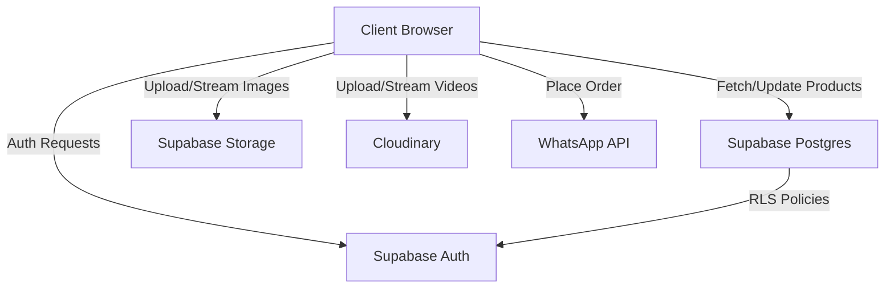

# System Architecture 🏗️

This document outlines the technical architecture of the **Perfumes By Luch** e-commerce platform.

## 🛠 Tech Stack

### Frontend
- **Framework**: React 18 with TypeScript
- **Build Tool**: Vite
- **Styling**: Tailwind CSS (Luxe "Antigravity" Design System)
- **Routing**: React Router DOM 6
- **Animations**: Framer Motion & CSS keyframes
- **Icons**: Lucide React
- **State Management**: React Context (Cart) & TanStack Query (Data fetching)

### Backend (BaaS)
- **Provider**: Supabase
- **Database**: PostgreSQL
- **Authentication**: Supabase Auth (Email/Password)
- **Storage**: Supabase Storage (Product Images)
- **Media Hosting**: Cloudinary (Product Videos)

## 📡 Data Flow

## ⚡ Performance Strategies

### 1. Asset Optimization
- **Images**: All Supabase images are processed via `getOptimisedImageUrl` to enforce WebP format and controlled widths/qualities.
- **Videos**: Cloudinary handles dynamic transcoding (f_auto, q_auto) and bitrate capping (1.5Mbps) to prevent mobile data drain.
- **LCP Optimization**: Critical assets (Logo, Hero slides) use `fetchPriority="high"` and `loading="eager"`.

### 2. Code Splitting
- The application uses **Route-based Lazy Loading**.
- Heavy modules like the `Admin` console and `Collections` page are separate chunks, keeping the homepage initial payload under ~100KB.

### 3. Caching & Persistence
- **Supabase**: Uses 1-hour cache control for storage assets.
- **Cart**: Persisted via LocalStorage through a custom React Context provider.

## 🔐 Security Model

### Row Level Security (RLS)
The Postgres database is protected by RLS:
- **`products`**: Public read access; write/update limited to `admin` or `owner` roles.
- **`reviews`**: Public read (if `visible=true`); public insert (for verified customers); delete limited to admins.
- **`profiles`**: Selectable by authenticated users; update/delete limited to the user or `owner`.
- **`activity_log`**: Read/Write limited to authenticated admins; Delete limited to `owner`.

### Role-Based Access Control (RBAC)
User roles are managed in the `profiles` table:
- **Owner**: Full system access, including team management and audit log clearing.
- **Admin**: Product and review management.
- **Restricted**: Read-only access to the dashboard.

## 🚀 Deployment Pipeline
- **Branch**: `main`
- **Host**: Vercel
- **Automatic Deploys**: Triggered on every push.
- **Environment Management**: Secrets (API keys) are managed in the Vercel Dashboard.
